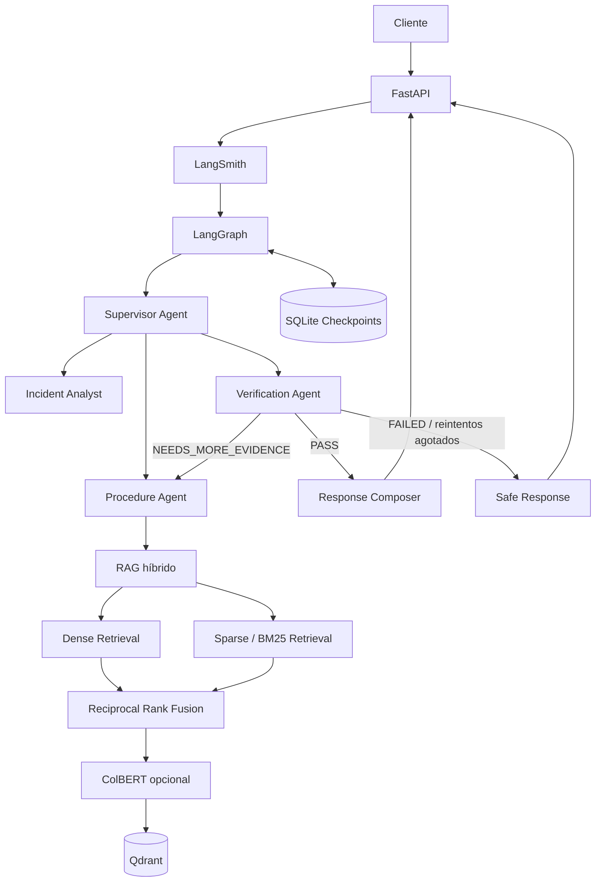

# SentinelAI

**SentinelAI** es un copiloto multiagente para operaciones de seguridad física y seguridad privada.

Combina **Retrieval-Augmented Generation (RAG)**, orquestación mediante **LangGraph**, agentes especializados, persistencia de estado, ciclos de verificación, observabilidad y una API desarrollada con **FastAPI** para brindar asistencia operativa basada en procedimientos documentados.

> **Importante:** SentinelAI es una herramienta de apoyo a la toma de decisiones. No reemplaza al personal de seguridad, supervisores, responsables operativos, autoridades ni servicios de emergencia.

---

## 1. Problema

Los equipos de seguridad física trabajan con información distribuida entre múltiples documentos:

- procedimientos de control de acceso;
- protocolos para visitantes;
- ingreso de proveedores;
- procedimientos ante incidentes;
- protocolos de emergencia;
- matrices de escalamiento;
- restricciones de áreas;
- consignas operativas;
- procedimientos de entrega y recepción de turno.

Durante una consulta o incidente, el operador necesita determinar rápidamente:

1. qué procedimiento corresponde;
2. qué evidencia se encuentra disponible;
3. si la información es suficiente;
4. si corresponde escalar la situación;
5. qué acciones están respaldadas por documentación;
6. qué información adicional debe obtenerse antes de continuar.

Una única llamada a un modelo de lenguaje no ofrece suficientes garantías para este tipo de escenario.

SentinelAI resuelve el problema mediante un **workflow multiagente persistente**, donde diferentes agentes recuperan información, analizan el incidente, verifican evidencia, solicitan nueva información cuando resulta necesario y generan una respuesta final únicamente después de superar la etapa de verificación.

---

## 2. Objetivo del proyecto

El objetivo es demostrar una arquitectura profesional de ingeniería de inteligencia artificial capaz de integrar:

- RAG híbrido;
- múltiples agentes especializados;
- decisiones dinámicas;
- ciclos correctivos;
- memoria persistente;
- validación estructurada;
- programación asíncrona;
- API profesional;
- observabilidad;
- pruebas automatizadas;
- manejo seguro de errores;
- despliegue reproducible.

SentinelAI fue diseñado como proyecto final de **Ingeniería en Inteligencia Artificial**, priorizando arquitectura, robustez, trazabilidad y reproducibilidad.

---

## 3. Capacidades principales

- Orquestación multiagente mediante LangGraph.
- Supervisor Agent con routing dinámico.
- Procedure Agent especializado en recuperación documental.
- Incident Analyst especializado en análisis de incidentes.
- Verification Agent encargado de validar evidencia.
- Response Composer para generar la respuesta final.
- Ciclos automáticos cuando la evidencia es insuficiente.
- Safe Response determinística cuando la verificación falla.
- RAG híbrido dense + sparse.
- Reciprocal Rank Fusion.
- Reranking opcional mediante ColBERT.
- Persistencia vectorial mediante Qdrant.
- Persistencia del grafo mediante SQLite.
- Soporte para Groq y OpenAI.
- Salidas estructuradas de los modelos.
- API asíncrona con FastAPI.
- Observabilidad mediante LangSmith.
- Logging JSON estructurado.
- Configuración mediante variables de entorno.
- Pruebas unitarias, de integración y end-to-end.
- Docker y Docker Compose.

---

## 4. Arquitectura



La arquitectura no utiliza una cadena lineal fija.

El estado del workflow determina qué agente debe ejecutarse a continuación y permite regresar a etapas anteriores cuando la evidencia recuperada no es suficiente.

---

## 5. Estado compartido

Los agentes trabajan sobre un estado común de LangGraph.

Entre sus campos principales se encuentran:

```text
messages
query
thread_id
route
retrieved_documents
sources
incident_analysis
verification_result
retry_count
final_answer
trace_id
agents_used
```

Este estado permite que cada agente conozca el resultado de las etapas anteriores y que el Supervisor tome decisiones dinámicamente.

---

## 6. Supervisor Agent

El Supervisor Agent decide qué nodo del grafo debe ejecutarse a continuación.

La decisión depende del estado actual del workflow, incluyendo:

- documentos recuperados;
- análisis disponible;
- resultado de verificación;
- cantidad de reintentos;
- respuesta final existente.

No se utiliza una secuencia rígida predefinida.

Esto permite delegación dinámica, ciclos y corrección de errores.

---

## 7. Procedure Agent

El Procedure Agent consulta la base documental mediante el sistema RAG.

Su función es encontrar los procedimientos más relevantes para la consulta.

Cuando el Verification Agent devuelve:

```text
NEEDS_MORE_EVIDENCE
```

el agente realiza recuperación adicional utilizando:

- la consulta original;
- la información faltante detectada;
- múltiples consultas derivadas.

Posteriormente combina resultados y elimina duplicados antes de continuar.

---

## 8. Incident Analyst

El Incident Analyst analiza conjuntamente:

- la consulta recibida;
- los documentos recuperados;
- los procedimientos aplicables.

Produce una salida estructurada que luego es evaluada por el Verification Agent.

---

## 9. Verification Agent

El Verification Agent determina si el análisis se encuentra realmente respaldado por la evidencia recuperada.

Puede producir tres estados:

```text
PASS
NEEDS_MORE_EVIDENCE
FAILED
```

### PASS

La información está suficientemente respaldada y el workflow puede avanzar hacia la composición final.

### NEEDS_MORE_EVIDENCE

La evidencia no es suficiente.

LangGraph genera un ciclo correctivo:

```text
Verification
     |
     v
Procedure Agent
     |
     v
Nueva recuperación
     |
     v
Incident Analyst
     |
     v
Verification
```

### FAILED

La información no puede verificarse de manera segura.

Si se produce este estado o se agota el límite de reintentos, el sistema evita generar una recomendación operativa no respaldada.

---

## 10. Response Composer

El Response Composer genera la respuesta destinada al usuario únicamente cuando la verificación fue aprobada.

El proceso queda separado en cuatro etapas:

```text
recuperación
     |
     v
análisis
     |
     v
verificación
     |
     v
composición
```

---

## 11. Safe Response

SentinelAI posee una respuesta segura determinística que **no utiliza un LLM**.

Se activa cuando:

- la verificación falla;
- se alcanza el máximo de reintentos;
- no existe evidencia suficiente.

Esto evita presentar como confiable una respuesta que no pudo verificarse.

---

## 12. Corpus documental

La base de conocimiento está formada por procedimientos sintéticos profesionales de seguridad privada redactados en español.

Actualmente incluye documentos sobre:

- control de acceso;
- gestión de visitantes;
- proveedores;
- respuesta ante incidentes;
- emergencias;
- escalamiento;
- áreas restringidas;
- entrega y recepción de turno.

Estado actual:

```text
Documentos: 8
Chunks determinísticos: 154
```

---

## 13. Pipeline de ingesta

```text
Documentos Markdown
        |
        v
Lectura de frontmatter
        |
        v
Parsing
        |
        v
Chunking semántico
        |
        +------------------+
        |                  |
        v                  v
Dense embeddings    Sparse embeddings
        |                  |
        +--------+---------+
                 |
                 v
          ColBERT vectors
                 |
                 v
              Qdrant
```

Los IDs de los puntos son determinísticos.

Por este motivo, volver a ejecutar la ingesta no genera duplicados.

---

## 14. Dense Retrieval

La recuperación semántica utiliza:

```text
sentence-transformers/paraphrase-multilingual-MiniLM-L12-v2
```

La implementación mantiene el comportamiento esperado del modelo y evita warnings de compatibilidad de FastEmbed sin modificar numéricamente los embeddings generados.

---

## 15. Sparse Retrieval

El sistema utiliza también recuperación sparse basada en BM25 mediante Qdrant.

Esto permite capturar coincidencias léxicas que podrían no aparecer utilizando únicamente embeddings densos.

---

## 16. Reciprocal Rank Fusion

Dense retrieval y sparse retrieval se ejecutan de manera asíncrona.

Los resultados se combinan utilizando:

```text
Reciprocal Rank Fusion
```

RRF permite fusionar los rankings generados por ambos métodos.

---

## 17. ColBERT

SentinelAI también soporta reranking mediante ColBERT.

Cuando se habilita esta estrategia, los candidatos obtenidos durante la recuperación híbrida son reordenados utilizando representación multi-vector.

---

## 18. Evaluación del retrieval

Se implementaron escenarios específicos para comparar las estrategias.

| Estrategia | MRR |
| --- | ---: |
| Dense | 0.850 |
| BM25 | 0.750 |
| RRF | 0.900 |
| RRF + ColBERT | 0.900 |

La configuración predeterminada utiliza:

```text
RRF
```

La evaluación muestra una mejora del retrieval híbrido frente a las estrategias individuales en los escenarios evaluados.

---

## 19. Persistencia

LangGraph utiliza:

```text
AsyncSqliteSaver
```

La ubicación predeterminada es:

```text
.sentinel/checkpoints.sqlite
```

Cada workflow recibe un:

```text
thread_id
```

Esto permite persistir el estado y continuar conversaciones o ejecuciones utilizando el mismo hilo.

---

## 20. Proveedores LLM

SentinelAI implementa una abstracción independiente del proveedor.

Actualmente soporta:

```text
Groq
OpenAI
```

El proveedor activo se selecciona mediante:

```text
LLM_PROVIDER
```

Variables asociadas:

```text
GROQ_API_KEY
GROQ_MODEL
OPENAI_API_KEY
OPENAI_MODEL
```

Las comunicaciones internas utilizan salidas estructuradas y contratos tipados.

---

## 21. FastAPI

La aplicación expone una API REST asíncrona mediante FastAPI.

### Health check

```http
GET /health
```

### Consulta principal

```http
POST /v1/query
Content-Type: application/json
```

Ejemplo:

```json
{
  "query": "Un visitante intenta ingresar a un área restringida sin autorización. ¿Cómo debo proceder?",
  "thread_id": "example-thread-001"
}
```

La respuesta puede incluir:

- respuesta final;
- thread ID;
- fuentes utilizadas;
- agentes ejecutados;
- metadata;
- trace ID.

Las entradas y salidas se validan mediante Pydantic.

---

## 22. Errores estructurados

La API utiliza respuestas de error tipadas.

Códigos implementados:

```text
runtime_unavailable
workflow_failed
workflow_incomplete
internal_error
```

Los contratos incluyen información segura como:

```text
code
message
thread_id
trace_id
```

Las excepciones internas del proveedor y los secretos no se exponen al cliente.

---

## 23. Programación asíncrona

El camino principal de la aplicación utiliza `async` / `await`.

Esto incluye:

- FastAPI;
- ejecución de LangGraph;
- recuperación documental;
- acceso a Qdrant;
- checkpoints;
- servicios LLM;
- ingesta.

No se utiliza `requests` dentro del flujo asíncrono principal.

---

## 24. Observabilidad con LangSmith

Cada consulta puede generar un trace raíz llamado:

```text
sentinel_query
```

Un workflow real con ciclo correctivo mostró una secuencia equivalente a:

```text
sentinel_query
|
|-- supervisor
|-- procedure_agent
|-- supervisor
|-- incident_analyst
|-- supervisor
|-- verification_agent
|
|-- supervisor
|-- procedure_agent
|-- supervisor
|-- incident_analyst
|-- supervisor
|-- verification_agent
|
|-- supervisor
`-- response_composer
```

La traza permite inspeccionar:

- agentes utilizados;
- llamadas al modelo;
- ciclos del grafo;
- tokens;
- duración;
- proveedor;
- modelo;
- metadata;
- identificador de trace.

Durante la validación real se observaron aproximadamente:

```text
Duración total: ~82 s
Tokens: ~16.8K
Costo estimado: ~$0.0022
Proveedor: Groq
Modelo: openai/gpt-oss-20b
```

---

## 25. Logging estructurado

Además de LangSmith, la aplicación genera logging estructurado en JSON.

Entre los campos disponibles se encuentran:

```text
timestamp
level
logger
event
thread_id
trace_id
duration_ms
error_code
llm_provider
app_env
```

Por seguridad, los logs no incluyen de forma estándar:

- API keys;
- secretos;
- consulta completa del usuario.

---

## 26. Configuración

La configuración utiliza:

```text
pydantic-settings
```

Principales grupos:

```text
APP_*
LLM_PROVIDER
GROQ_*
OPENAI_*
LANGSMITH_*
QDRANT_*
RETRIEVAL_*
CHECKPOINT_DB_PATH
LOG_LEVEL
```

Las credenciales no se encuentran hardcodeadas.

El archivo:

```text
.env
```

está excluido de Git.

El repositorio incluye:

```text
.env.example
```

como referencia segura.

---

## 27. Instalación local

### Requisitos

- Python 3.12
- Git

Crear el entorno:

```powershell
py -3.12 -m venv .venv
```

Activarlo:

```powershell
.\.venv\Scripts\Activate.ps1
```

Instalar el proyecto:

```powershell
python -m pip install -e ".[dev]"
```

Crear configuración:

```powershell
Copy-Item .env.example .env
```

Luego completar las credenciales necesarias dentro de `.env`.

---

## 28. Ingesta

Ejecutar:

```powershell
python scripts\ingest.py
```

Resultado validado:

```text
Ingested 154 chunks from 8 documents.
```

La operación es idempotente.

---

## 29. Ejecutar la API

```powershell
python -m uvicorn app.api.main:app --host 127.0.0.1 --port 8000
```

Dirección de la API:

```text
http://localhost:8000
```

Health check:

```text
http://localhost:8000/health
```

Swagger / OpenAPI:

```text
http://localhost:8000/docs
```

---

## 30. Docker

El repositorio incluye:

```text
Dockerfile
docker-compose.yml
.dockerignore
run.sh
run.ps1
```

Antes de iniciar:

```powershell
Copy-Item .env.example .env
```

### Linux / macOS

```bash
./run.sh
```

### Windows PowerShell

```powershell
.\run.ps1
```

Ambos scripts ejecutan:

```text
docker compose up --build
```

El contenedor realiza la ingesta antes de iniciar Uvicorn.

Se utilizan volúmenes persistentes para:

- Qdrant;
- checkpoints SQLite.

> La configuración Docker se encuentra implementada y validada estáticamente. La máquina utilizada durante el desarrollo no disponía de Docker instalado, por lo que la ejecución real del contenedor debe validarse posteriormente en un entorno compatible.

---

## 31. Testing

Ejecutar toda la suite:

```powershell
python -m pytest -q
```

Último resultado validado:

```text
119 passed
```

Estructura:

```text
tests/
|-- unit/
|-- integration/
`-- e2e/
```

Los escenarios end-to-end incluyen:

- ejecución multiagente exitosa;
- ciclo correctivo;
- supervisor dinámico;
- persistencia del grafo;
- safe response.

Las dependencias externas se sustituyen por test doubles controlados para mantener las pruebas determinísticas.

---

## 32. Calidad estática

SentinelAI utiliza Ruff.

```powershell
python -m ruff check .
```

Resultado actual:

```text
All checks passed!
```

---

## 33. Estructura del proyecto

```text
sentinel-ai/
|
|-- data/
|   `-- documents/
|
|-- docs/
|
|-- evidence/
|
|-- scripts/
|   `-- ingest.py
|
|-- src/
|   `-- app/
|       |-- agents/
|       |-- api/
|       |-- config/
|       |-- graph/
|       |-- models/
|       |-- observability/
|       |-- rag/
|       `-- services/
|
|-- tests/
|   |-- unit/
|   |-- integration/
|   `-- e2e/
|
|-- .dockerignore
|-- .env.example
|-- .gitignore
|-- Dockerfile
|-- docker-compose.yml
|-- pyproject.toml
|-- run.ps1
`-- run.sh
```

---

## 34. Stack tecnológico

| Área | Tecnología |
| --- | --- |
| Lenguaje | Python 3.12 |
| API | FastAPI |
| Validación | Pydantic |
| Configuración | pydantic-settings |
| Orquestación | LangGraph |
| Integración LLM | LangChain |
| Proveedores | Groq / OpenAI |
| Vector database | Qdrant |
| Embeddings | FastEmbed |
| Retrieval | Dense + BM25 + RRF + ColBERT |
| Checkpoints | SQLite |
| Observabilidad | LangSmith |
| Testing | Pytest |
| Calidad | Ruff |
| Contenedores | Docker / Docker Compose |

---

## 35. Principios de diseño

1. Recuperar antes de generar.
2. Verificar antes de responder.
3. Utilizar routing dinámico.
4. Permitir ciclos correctivos.
5. Disponer de un fallback determinístico.
6. Validar fronteras mediante modelos tipados.
7. Utilizar async en el flujo principal.
8. Persistir el estado.
9. Observar las ejecuciones.
10. Permitir despliegue reproducible.
11. No exponer secretos.
12. Mantener desacoplado el proveedor LLM.

---

## 36. Seguridad

SentinelAI incorpora medidas como:

- secretos fuera del código;
- `.env` excluido del repositorio;
- validación Pydantic;
- errores sanitizados;
- verificación antes de responder;
- fallback determinístico;
- aislamiento mediante `thread_id`;
- logs sin credenciales;
- logs sin consultas completas;
- separación entre retrieval, análisis, verificación y composición.

El sistema no debe considerarse una autoridad autónoma para decisiones de seguridad física.

Las acciones reales deben respetar:

- procedimientos oficiales;
- responsables de la organización;
- legislación;
- autoridades competentes;
- servicios de emergencia cuando corresponda.

---

## 37. Estado de validación

```text
Python 3.12 ................. OK
RAG ingestion ............... OK
Documentos .................. 8
Chunks ...................... 154
Dense retrieval ............. OK
BM25 ........................ OK
RRF ......................... OK
ColBERT ..................... OK
Multi-agent workflow ........ OK
Supervisor dinámico ......... OK
Ciclos correctivos .......... OK
Safe response ............... OK
SQLite checkpoints .......... OK
FastAPI ..................... OK
Errores estructurados ....... OK
LangSmith ................... OK
Logging JSON ................ OK
Ruff ........................ All checks passed!
Tests ....................... 119 passed
Docker configuration ........ Implementada
Docker runtime .............. Pendiente de validar
```

---

## 38. Resultado arquitectónico

SentinelAI no funciona como un chatbot basado únicamente en un prompt.

La arquitectura obliga al sistema a recorrer etapas diferenciadas:

```text
Consulta
   |
   v
Supervisor
   |
   v
Recuperación
   |
   v
Análisis
   |
   v
Verificación
   |
   +------ evidencia insuficiente ------+
   |                                    |
   +----------- nueva recuperación <----+
   |
   v
Respuesta final
```

Esto permite obtener un sistema más:

- controlable;
- auditable;
- observable;
- verificable;
- persistente;
- robusto.

---

## 39. Contexto académico

Proyecto desarrollado como entrega final de un curso de **Ingeniería en Inteligencia Artificial**.

Integra conceptos de:

- ingeniería de software;
- inteligencia artificial generativa;
- agentes;
- RAG;
- LangGraph;
- FastAPI;
- persistencia;
- observabilidad;
- testing;
- deployment;
- configuración segura.

El caso de uso corresponde a operaciones de seguridad privada y utiliza procedimientos sintéticos creados con fines educativos.

---

## 40. Autor

**Agustín Gutiérrez**

Proyecto final de Ingeniería en Inteligencia Artificial.