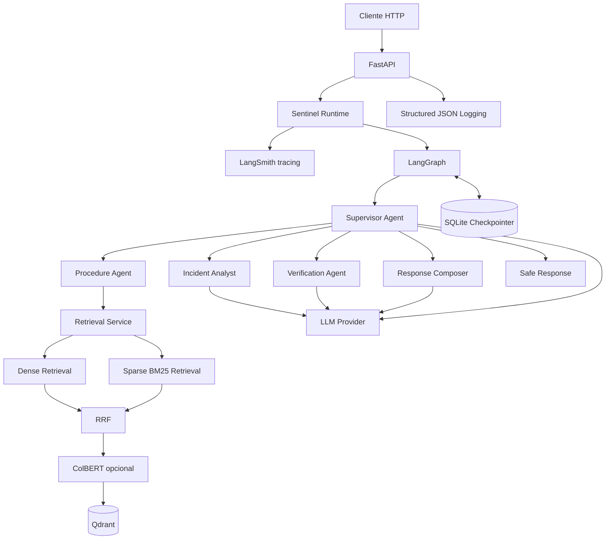
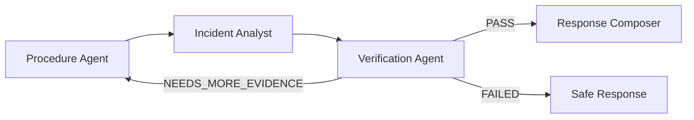

# Arquitectura de SentinelAI

## 1. Propósito

Este documento describe la arquitectura técnica de **SentinelAI**, un copiloto multiagente orientado a operaciones de seguridad física y seguridad privada.

El objetivo arquitectónico principal es evitar que una respuesta operativa dependa de una única llamada a un modelo de lenguaje.

SentinelAI separa explícitamente:

- recuperación de evidencia;
- análisis;
- verificación;
- decisión de routing;
- composición de respuesta;
- persistencia;
- observabilidad.

La arquitectura prioriza:

- trazabilidad;
- robustez;
- validación;
- recuperación basada en evidencia;
- ciclos correctivos;
- aislamiento de responsabilidades;
- reproducibilidad.

---

## 2. Vista general



---

## 3. Capas principales

La solución se divide conceptualmente en las siguientes capas:

```text
API
 |
 v
Application Runtime / Bootstrap
 |
 v
LangGraph Orchestration
 |
 +-------------------+
 |                   |
 v                   v
Agents             Services
 |                   |
 v                   v
RAG                LLM Provider
 |
 v
Qdrant
```

Cada capa tiene una responsabilidad definida.

---

## 4. API

La capa HTTP se implementa con FastAPI.

Responsabilidades:

- recibir solicitudes;
- validar payloads con Pydantic;
- generar o propagar identificadores;
- iniciar el workflow;
- devolver respuestas tipadas;
- convertir fallos internos en errores HTTP estructurados;
- integrar trazabilidad y logging.

Endpoints principales:

```text
GET /health
POST /v1/query
```

La API no contiene lógica específica de retrieval ni lógica de agentes.

Su responsabilidad es actuar como frontera de entrada y salida.

---

## 5. Composition Root

La construcción del sistema se centraliza en:

```text
src/app/bootstrap.py
```

El bootstrap crea y conecta:

- configuración;
- cliente Qdrant;
- servicio de embeddings;
- retrieval service;
- proveedor LLM;
- agentes especializados;
- checkpointer;
- workflow LangGraph.

Este patrón evita que cada módulo construya sus propias dependencias.

La aplicación dispone así de un único punto de composición.

---

## 6. Configuración

La configuración utiliza:

```text
pydantic-settings
```

Las variables son cargadas desde entorno.

Entre las principales se encuentran:

```text
APP_*
LLM_PROVIDER
GROQ_*
OPENAI_*
LANGSMITH_*
QDRANT_*
RETRIEVAL_*
CHECKPOINT_DB_PATH
LOG_LEVEL
```

Principios:

- no hardcoding de secretos;
- configuración tipada;
- validación temprana;
- posibilidad de cambiar proveedor sin modificar agentes;
- separación entre configuración y código.

---

## 7. LangGraph como núcleo de orquestación

LangGraph representa el workflow como un grafo de estados.

El sistema no utiliza una cadena fija equivalente a:

```text
A -> B -> C -> D
```

El Supervisor inspecciona el estado y decide el próximo nodo.

Una ejecución puede seguir:

```text
Supervisor
   |
   v
Procedure
   |
   v
Supervisor
   |
   v
Incident Analyst
   |
   v
Supervisor
   |
   v
Verification
   |
   +---------- PASS ----------> Response Composer
   |
   +-- NEEDS_MORE_EVIDENCE --> Procedure
   |
   +--------- FAILED ---------> Safe Response
```

Esto permite ciclos reales dentro del workflow.

---

## 8. Estado compartido

Los nodos operan sobre un estado común.

Campos principales:

```text
messages
query
thread_id
route
retrieved_documents
sources
incident_analysis
verification_result
retry_count
final_answer
trace_id
agents_used
```

La utilización de estado explícito permite:

- trazabilidad;
- persistencia;
- routing;
- decisiones basadas en etapas previas;
- recuperación posterior;
- debugging reproducible.

---

## 9. Supervisor Agent

El Supervisor es responsable de elegir el siguiente paso.

No produce directamente la respuesta operativa.

Evalúa información como:

- si existe recuperación previa;
- si existe análisis;
- estado de verificación;
- cantidad de reintentos;
- existencia de respuesta final.

El Supervisor funciona como coordinador del sistema multiagente.

Su diseño permite agregar nuevos agentes sin convertir el workflow en una secuencia rígida.

---

## 10. Procedure Agent

Responsabilidad:

```text
obtener evidencia documental relevante
```

El agente utiliza el Retrieval Service en lugar de acceder directamente a Qdrant.

En la primera ejecución utiliza la consulta original.

Si el Verification Agent determina que falta evidencia:

```text
NEEDS_MORE_EVIDENCE
```

se generan consultas adicionales relacionadas con la información faltante.

Los resultados se fusionan y eliminan duplicados.

Esto convierte el retrieval en un proceso adaptativo.

---

## 11. Incident Analyst

El Incident Analyst recibe:

- consulta;
- evidencia recuperada;
- fuentes.

Produce un análisis estructurado.

La separación del análisis respecto de la composición final permite validar primero el razonamiento operativo antes de convertirlo en una respuesta destinada al usuario.

---

## 12. Verification Agent

El Verification Agent funciona como control de calidad.

Estados posibles:

```text
PASS
NEEDS_MORE_EVIDENCE
FAILED
```

### PASS

La evidencia respalda suficientemente el análisis.

### NEEDS_MORE_EVIDENCE

El análisis requiere documentación adicional.

La ejecución vuelve al Procedure Agent.

### FAILED

No es posible producir una respuesta suficientemente respaldada.

El flujo se deriva hacia la Safe Response.

---

## 13. Ciclo correctivo

Uno de los elementos centrales de SentinelAI es la capacidad de corregirse mediante un ciclo.



El ciclo evita continuar automáticamente cuando la primera recuperación no contiene evidencia suficiente.

El número de intentos es limitado para evitar loops indefinidos.

---

## 14. Response Composer

El Response Composer solo participa después de una verificación aprobada.

Su responsabilidad es transformar la información verificada en una respuesta:

- clara;
- contextual;
- accionable;
- consistente con las fuentes.

No decide si la evidencia es suficiente.

Esa responsabilidad pertenece al Verification Agent.

---

## 15. Safe Response

La Safe Response es determinística.

No utiliza un LLM.

Se utiliza cuando:

- la verificación falla;
- se agota el límite de reintentos;
- el workflow no dispone de evidencia suficiente.

Esta decisión reduce el riesgo de producir una respuesta aparentemente convincente pero no respaldada.

---

## 16. Arquitectura RAG

El subsistema RAG se divide en:

```text
Parsing
   |
   v
Chunking
   |
   v
Embedding
   |
   v
Ingestion
   |
   v
Qdrant
   |
   v
Retrieval
   |
   v
Fusion / Reranking
```

Cada responsabilidad está separada en módulos específicos.

---

## 17. Parsing

Los documentos Markdown utilizan metadata estructurada mediante frontmatter.

El parser transforma cada archivo en una representación documental consistente.

Esto permite separar:

- contenido;
- metadata;
- identificación de fuente.

---

## 18. Chunking

El chunking se realiza por secciones semánticas.

Objetivos:

- conservar contexto;
- evitar fragmentos excesivamente grandes;
- mantener identificación determinística;
- favorecer retrieval preciso.

La configuración utiliza límites de tamaño y overlap.

El corpus actual produce:

```text
154 chunks
```

a partir de:

```text
8 documentos
```

---

## 19. Embeddings

Se generan diferentes representaciones.

### Dense

Modelo multilingüe:

```text
sentence-transformers/paraphrase-multilingual-MiniLM-L12-v2
```

Dimensión:

```text
384
```

### Sparse

Se utiliza BM25 mediante FastEmbed/Qdrant.

### ColBERT

Se genera representación multi-vector para reranking.

---

## 20. Qdrant

Qdrant funciona como almacenamiento vectorial.

La colección contiene vectores nombrados para:

```text
dense
sparse
colbert
```

El sistema soporta:

```text
QDRANT_MODE=local
QDRANT_MODE=server
```

Durante desarrollo se utiliza almacenamiento local persistente.

El diseño permite migrar a un servidor Qdrant sin modificar la lógica de retrieval.

---

## 21. Idempotencia de ingesta

Los IDs de los chunks se generan de manera determinística.

Esto garantiza que ejecutar nuevamente:

```powershell
python scripts\ingest.py
```

actualice los mismos puntos en lugar de generar duplicados.

Resultado validado:

```text
154 puntos
```

antes y después de repetir la ingesta.

---

## 22. Retrieval asíncrono

Dense retrieval y sparse retrieval pueden ejecutarse concurrentemente.

Conceptualmente:

```text
             +--> Dense retrieval --+
Query -------+                      +--> Fusion
             +--> Sparse retrieval -+
```

Esto reduce dependencia secuencial entre búsquedas independientes.

---

## 23. Reciprocal Rank Fusion

Los rankings dense y sparse se combinan mediante Reciprocal Rank Fusion.

La estrategia evita depender exclusivamente de:

- similitud semántica;
- coincidencia léxica.

Resultados internos:

| Estrategia | MRR |
| --- | ---: |
| Dense | 0.850 |
| BM25 | 0.750 |
| RRF | 0.900 |
| RRF + ColBERT | 0.900 |

RRF es la estrategia predeterminada.

---

## 24. Abstracción del proveedor LLM

Los agentes no dependen directamente de una implementación concreta de OpenAI o Groq.

Se utiliza una factoría independiente del proveedor.

Configuración:

```text
LLM_PROVIDER=groq
```

o:

```text
LLM_PROVIDER=openai
```

Esto reduce acoplamiento y permite cambiar el backend sin reescribir el workflow.

---

## 25. Structured Outputs

Las comunicaciones relevantes con los modelos utilizan respuestas estructuradas.

Ventajas:

- validación automática;
- reducción de parsing manual;
- contratos explícitos;
- errores detectables;
- mejor integración con el grafo.

Pydantic actúa como frontera de validación.

---

## 26. Persistencia del grafo

LangGraph utiliza:

```text
AsyncSqliteSaver
```

La persistencia utiliza `thread_id` como identificador de conversación/workflow.

Flujo:

```text
Request
   |
   v
thread_id
   |
   v
LangGraph
   |
   v
SQLite Checkpoint
```

Esto permite recuperar el estado entre ejecuciones.

---

## 27. Observabilidad

SentinelAI combina dos mecanismos.

### LangSmith

Permite inspeccionar:

- spans;
- agentes;
- modelos;
- duración;
- tokens;
- ciclos;
- metadata;
- trace ID.

### Logging JSON

Permite registrar eventos de aplicación.

Campos posibles:

```text
timestamp
level
logger
event
thread_id
trace_id
duration_ms
error_code
llm_provider
app_env
```

Ambos mecanismos cumplen funciones complementarias.

---

## 28. Correlación de ejecución

La utilización conjunta de:

```text
thread_id
trace_id
```

permite correlacionar:

- solicitud HTTP;
- workflow;
- logs;
- trace de LangSmith.

Esto facilita debugging y auditoría.

---

## 29. Manejo de errores

Los errores de infraestructura o workflow no se devuelven directamente.

La API utiliza errores tipados:

```text
runtime_unavailable
workflow_failed
workflow_incomplete
internal_error
```

El objetivo es evitar exponer:

- stack traces;
- API keys;
- errores internos del proveedor;
- detalles sensibles.

---

## 30. Asincronía

La ruta principal es asíncrona.

Incluye:

- endpoint HTTP;
- LangGraph;
- Qdrant;
- retrieval;
- embeddings;
- checkpointer;
- servicios de modelo.

Se evita introducir operaciones HTTP síncronas mediante `requests` dentro del flujo de aplicación.

---

## 31. Testing

La estrategia de pruebas se divide en:

```text
unit
integration
e2e
```

### Unit

Valida componentes aislados.

### Integration

Valida interacción entre subsistemas.

### E2E

Valida workflows completos del grafo.

Existen al menos cinco escenarios end-to-end:

- flujo multiagente exitoso;
- ciclo correctivo;
- supervisor dinámico;
- persistencia;
- safe response.

---

## 32. Determinismo en tests

Las pruebas automáticas del grafo no dependen de respuestas reales de proveedores externos.

Se utilizan implementaciones controladas para:

- LLM;
- retrieval;
- decisiones.

Esto permite:

- repetibilidad;
- ejecución offline;
- reducción de flakiness;
- assertions precisas.

Las llamadas reales se validan separadamente durante pruebas manuales de integración.

---

## 33. Deployment

La aplicación incluye:

```text
Dockerfile
docker-compose.yml
run.sh
run.ps1
```

Objetivo:

```text
clean clone
   |
   v
.env
   |
   v
docker compose up --build
   |
   v
ingestion
   |
   v
FastAPI
```

El runtime utiliza volúmenes persistentes para:

- Qdrant;
- SQLite.

---

## 34. Seguridad de secretos

Los secretos se almacenan únicamente mediante variables de entorno.

`.gitignore` excluye:

```text
.env
.env.*
```

con excepción explícita de:

```text
.env.example
```

El contexto Docker también excluye `.env`.

De esta forma, las credenciales locales no son copiadas dentro de la imagen durante el build.

---

## 35. Límites operativos

SentinelAI no es un sistema autónomo de control físico.

No realiza directamente:

- bloqueo de accesos;
- apertura de puertas;
- control de cámaras;
- llamadas de emergencia;
- sanciones;
- decisiones disciplinarias.

El sistema brinda soporte documental y analítico.

Las acciones continúan bajo responsabilidad humana.

---

## 36. Decisiones arquitectónicas clave

Las decisiones más relevantes son:

```text
LangGraph en lugar de cadena lineal
RAG híbrido en lugar de dense-only
Verification Agent separado del Analyst
Safe Response determinística
SQLite checkpoints
Qdrant persistente
Proveedor LLM desacoplado
Pydantic en fronteras
FastAPI async
LangSmith + logging estructurado
Docker reproducible
```

Estas decisiones se documentan con mayor detalle mediante Architecture Decision Records dentro de:

```text
docs/adr/
```

---

## 37. Estado actual

Validaciones locales realizadas:

```text
Python 3.12 ................. OK
RAG ingestion ............... OK
154 puntos .................. OK
Hybrid retrieval ............ OK
Multi-agent graph ........... OK
Corrective cycle ............ OK
Dynamic routing ............. OK
Safe response ............... OK
SQLite persistence .......... OK
FastAPI ..................... OK
LangSmith ................... OK
Structured logging .......... OK
Ruff ........................ OK
Tests ....................... 119 passed
```

La configuración Docker fue validada mediante GitHub Actions en una máquina Ubuntu limpia. El workflow construye la imagen, inicia un contenedor real y comprueba exitosamente el endpoint /health.