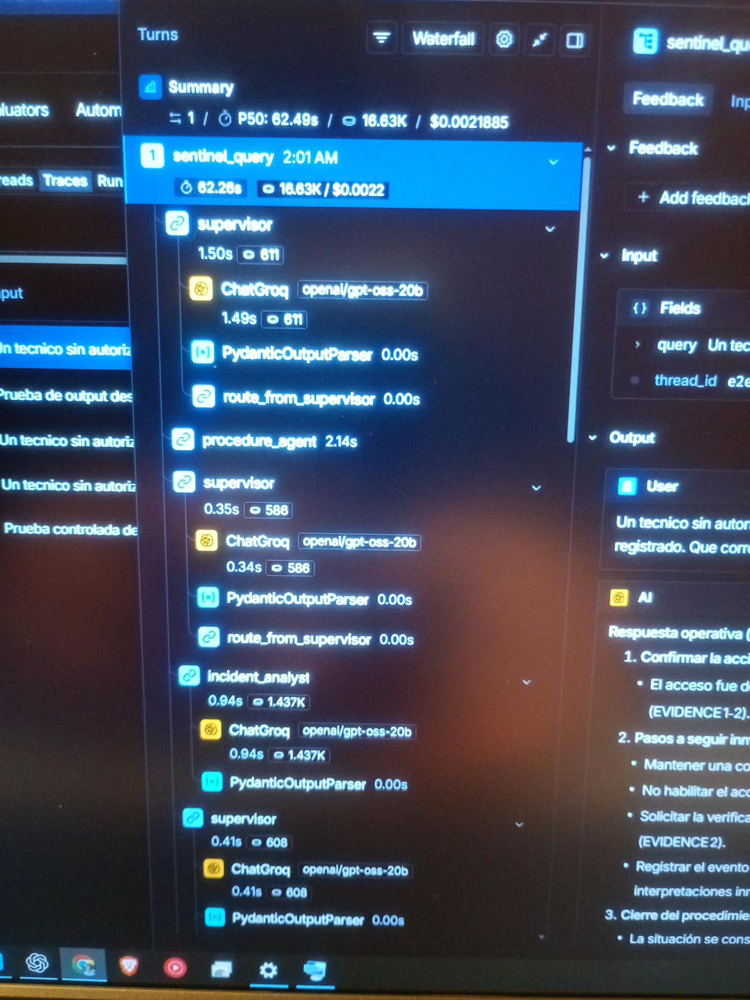
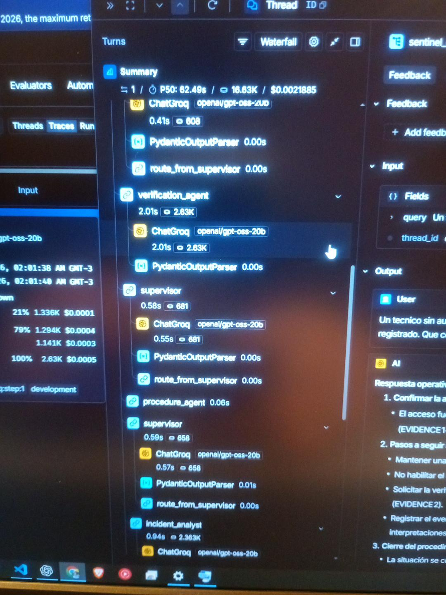
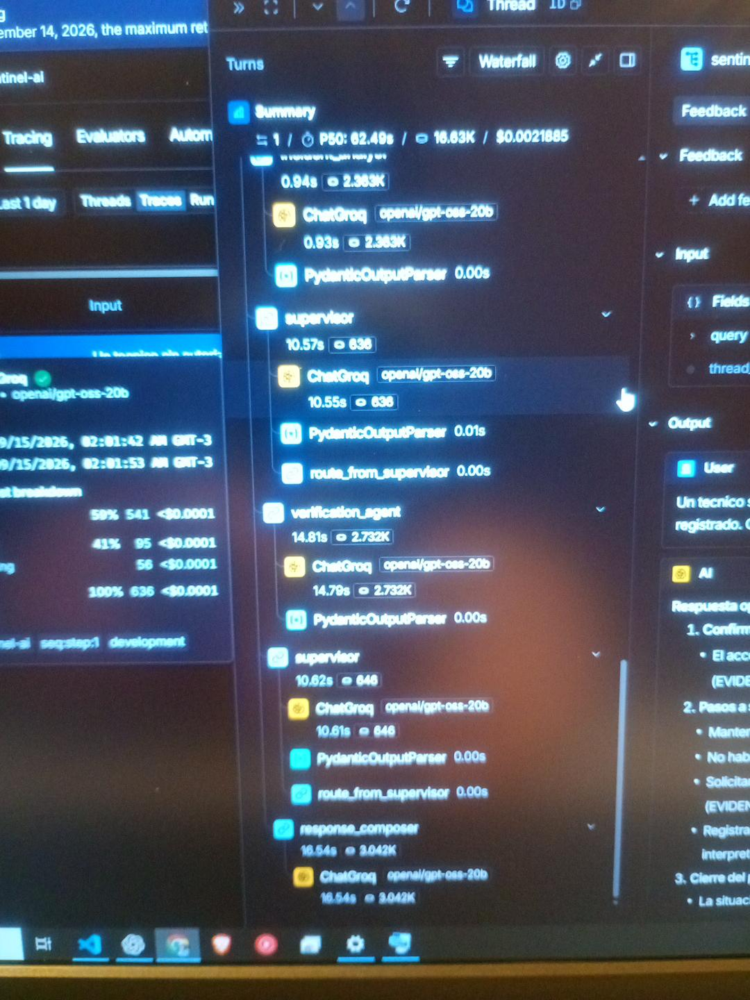
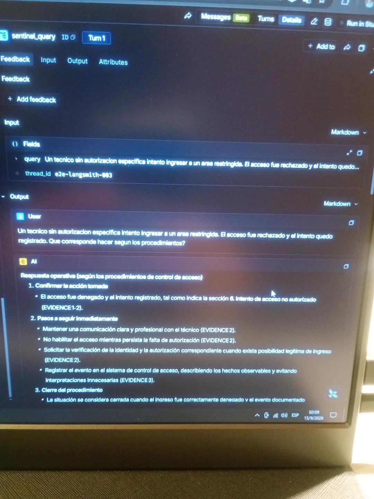
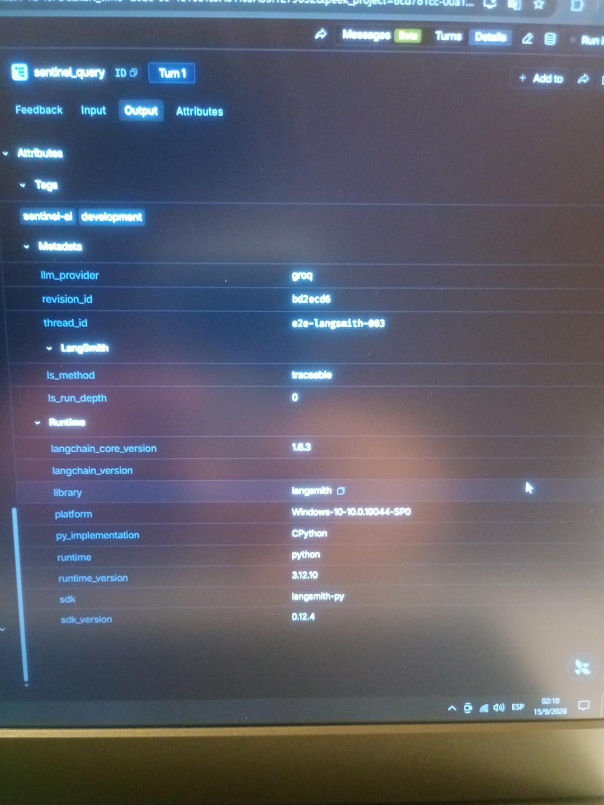

# Evidencia visual de LangSmith

Esta carpeta contiene capturas reales obtenidas durante una ejecución completa de SentinelAI con observabilidad habilitada mediante LangSmith.

## Ejecución asociada

```text
thread_id:
e2e-langsmith-003
```

```text
trace_id:
01a0a371-1847-7230-b3b4-e73fa5ceaa50
```

Proveedor:

```text
Groq
```

Modelo observado:

```text
openai/gpt-oss-20b
```

## Qué demuestran estas capturas

En conjunto, las imágenes permiten observar evidencia de:

- trace raíz `sentinel_query`;
- ejecución de múltiples agentes;
- Supervisor Agent;
- Procedure Agent;
- Incident Analyst;
- Verification Agent;
- ciclo correctivo de recuperación;
- segunda etapa de verificación;
- Response Composer;
- duración de la ejecución;
- uso de tokens;
- costo estimado;
- metadata de proveedor y modelo.

La ejecución observada presentó un ciclo equivalente a:

```text
supervisor
procedure_agent
supervisor
incident_analyst
supervisor
verification_agent
supervisor
procedure_agent
supervisor
incident_analyst
supervisor
verification_agent
supervisor
response_composer
```

Esto demuestra que SentinelAI no opera como una cadena lineal fija.

## Capturas

### LangSmith 01



### LangSmith 02



### LangSmith 03



### LangSmith 04



### LangSmith 05



## Métricas observadas

Durante esta ejecución se observaron aproximadamente:

```text
Duración total: ~82 segundos
Tokens: ~16.8K
Costo estimado: ~$0.0022
```

Estas métricas corresponden a esta ejecución específica y no representan un benchmark general del sistema.

## Nota

Las imágenes de esta carpeta corresponden a evidencia real.

No contienen credenciales ni API keys y no fueron generadas artificialmente para la entrega.